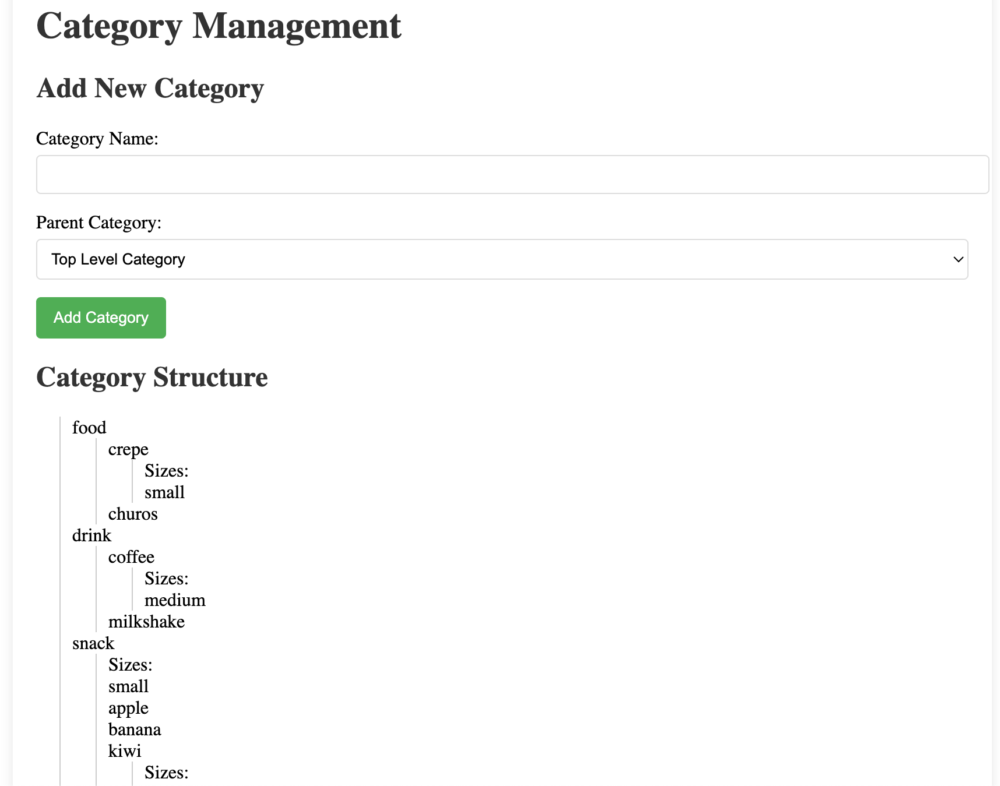

# Retail-management-apps

## User Login

1. Spring Security set up 

- Security config class is in Configuration package (@ Configuration). This class requires a bean of custom UserDetailsService ( named MyUserDetailsService) and a bean of PasswordEncoder method. 

- MyUserDetailsService is defined as a Service (@ Service) in Service package. This class is an implementation of org.springframework.security.core.userdetails.UserDetailsService. It is responsible for get User by username from database and match the User found to UserDetails object for Spring Security to use in authentication and authorization process. 

- In this project, UserDetails class is also customized as MyUserDetails class in Dto package. 
```java
public class MyUserDetails implements UserDetails {
	
	private static final long serialVersionUID = 1L;
	private String userName;
	private String password;
	private UserStatus status;
	private Set<GrantedAuthority> authorities;
	private Role role;
```
- Since this is a management apps, users will have different roles and according to each roles, we have different set of authorizations or permissions. Role Hierarchy bean is defined in HierarchyConfig class in Configuration package :
```java
@Configuration
public class HierarchyConfig {

	@Bean
	public RoleHierarchy roleHierarchy() {

		return RoleHierarchyImpl.fromHierarchy("ROLE_Owner > ROLE_Manager > ROLE_Staff");
	}
}
```
- Our intention is to use this hierarchy to allow user with higher roles to have all permissions available to lower roles. In order to do this, for each role, we need to define a set of authorities that include not only authorities specifically for that role, but also all authorities of roles that lower than that role. This is done inside findUserByUsername method of MyUserDetailsService: 
```java
@Override
	public UserDetails loadUserByUsername(String username) throws UsernameNotFoundException {
		User user = userRepository.findByUsername(username).orElseThrow(() -> new UsernameNotFoundException("Not found: " + username));

		Set<GrantedAuthority> authorities = new HashSet<>(user.getRole().getAuthorities());
		
		// Use role hierarchy to determine all applicable roles
        Collection<? extends GrantedAuthority> hierarchicalAuthorities = 
            roleHierarchy.getReachableGrantedAuthorities(authorities);
        
        // Include all initial and hierarchical authorities
        Set<GrantedAuthority> allAuthorities = new HashSet<>(authorities);
        allAuthorities.addAll(hierarchicalAuthorities);
        
     // Add authorities for roles that weren't in the original set
        for (GrantedAuthority authority : hierarchicalAuthorities) {
            if (authority.getAuthority().startsWith("ROLE_") && !authorities.contains(authority)) {
                String roleName = authority.getAuthority().substring(5);
                allAuthorities.addAll(getAuthoritiesForRole(roleName));
            }
        }
       
		return new MyUserDetails(user.getUsername(),user.getPassword(),user.getStatus(),allAuthorities, user.getRole());

	}

	private Collection<? extends GrantedAuthority> getAuthoritiesForRole(String roleName) {
		List<Role>roles = roleRepository.findAll();
		
		for(Role role : roles) {
			if(roleName.equalsIgnoreCase(role.getRoleName())) {
				return role.getAuthorities();
			}
		}
		return Collections.emptyList();
	}
```
- In the context of this project, Staff user can only access methods relating to order processing methods such as: add items to order, view current order, reset order, place order and accept payment either in cash or paypal. Meanwhile, Manager, apart from ability to access all methods available to Staff, can further approve refund for cancelled orders, register new Staff, view reports. Owner is the only type of user with access to product and category-related methods such as add new category, new product, and register new user as a manager or an owner. 

2. Login function
- Normal login requires only username and password to access. Once login is successful, redirection for different type of users is managed by CustomAuthenticationSuccessHandler class in Configuration class. This class extracts username from SecurityContextHolder and use that to get User entity from database. This user is set as an attribute of the sessionOrder. Then the class either redirect user to management dashboard ( if user is Manager or Owner) or to index page (if user is Staff). Fail login will be redirect back to Login page. When user enter into unauthorized page, Spring security will redirect user to CustomAccessDeniedHandler class which will redirect user to accessDenied Get API in LoginController and finally to accessDenied.jsp page. 

3. Remember Me - Persistent Based Remember Me cookie

- The filter responsible for handling "Remember Me" functionality, often called RememberMeAuthenticationFilter or similar, is configured to look for a specific parameter name in the login request. By default, this parameter is usually named "rememberMe" or "remember-me". 

- Filter processing: When the login request is processed, the authentication filter checks for the presence of the "rememberMe" parameter.If the parameter is present and set to "true", the filter initiates the remember-me process.This typically involves creating a persistent token or cookie that allows the user to be automatically logged in on subsequent visits

- First step is to create a persistent_logins table in database : 
```java
create table persistent_logins (username varchar(64) not null,
								series varchar(64) primary key,
								token varchar(64) not null,
								last_used timestamp not null)
```
- RememberMe service creation requires three arguments:

  **rememberMeKey** : The key is a secret value used by the server to validate remember-me tokens. It's not sent to the client side like in JWT, but rather used internally by Spring Security to ensure the integrity and authenticity of the remember-me process.It acts as a shared secret between different instances of your application.This ensures that a token generated by one instance can be validated by another, providing seamless user experience across different servers.Furthermore, changing the key invalidates all existing remember-me tokens, which is a useful security feature.Spring Security uses this key internally in its token generation if it is not persistence-based and for only validation processes if it is persistence-based.It's part of the security mechanism that prevents token forgery or tampering.

  **myUserDetailsService**:When a remember-me token is presented, this service is used to load the user details for authentication. This is also necessary so that the user's password is available and can be checked as part of the encoded cookie.For example, the cookie encoded by this implementation adopts the following form:

  a. TokenBasedRememberMeService

```java
 username + ":" + expiryTime + ":" + algorithmName + ":"
                + algorithmHex(username + ":" + expiryTime + ":" + password + ":" + key)
```
---> for reference, we can see method makeTokenSignature in TokenBasedRememberMeServices class of Spring-Security: 
```java
	protected String makeTokenSignature(long tokenExpiryTime, String username, String password) {
		String data = username + ":" + tokenExpiryTime + ":" + password + ":" + getKey();
		try {
			MessageDigest digest = MessageDigest.getInstance(this.encodingAlgorithm.getDigestAlgorithm());
			return new String(Hex.encode(digest.digest(data.getBytes())));
		}
		catch (NoSuchAlgorithmException ex) {
			throw new IllegalStateException("No " + this.encodingAlgorithm.name() + " algorithm available!");
		}
	}
```
"This implementation uses the algorithm configured in encodingAlgorithm to encode the signature. It will try to use the algorithm retrieved from the algorithmName to validate the signature. However, if the algorithmName is not present in the cookie value, the algorithm configured in matchingAlgorithm will be used to validate the signature. This allows users to safely upgrade to a different encoding algorithm while still able to verify old ones if there is no algorithmName present."

As such, if the user changes their password, any remember-me token will be invalidated. Equally, the system administrator may invalidate every remember-me token on issue by changing the key.

---> when method processAutoLoginCokkie is triggered, first thing it will check for the cookieLength, expiryTime - cookieToken [ 1 ], then it uses UserDetailsService to load User by username stored as cookieTokens[ 0 ]. After User is retrieved, it gets the main part of the token cookieToken [ 3] or cookieToken [ 2] if the cookieToken doesnt contain matching Algorithm name. We knows this by checking the cookieToken's length. With parameters including: tokenExpiryTime, username, password( retrieved from database) and the algorithm, it creates a value called expectedTokenSignature. This value is used to compared with the main part of the cookieToken. 

---> When login is successful, onLoginSuccess() method is triggered. This method will retrieve username and password from authentication object : authentication.getPrincipal(). It also retrieve username and password from database if there are any changes in database. Then, it calculates the login life time to see if token is expired or not, if expired, new expiry time = 2 weeks - tokenLifetime. If not yet expired, it remains the tokenLifetime as expiry time. 
All these information then be used to create a new token signature value to be set in a new cookie sent back to client. 

b. PersistentTokenBasedRememberMeServices

- This token value is actually shorter than the previous one since the token string only contains two value: cookieTokens [ 0] -> presentedSeries and cookieTokens [ 1] -> presentedToken

- ProcessAutoLoginCookie in this class will involve following steps: 

 --> check cookieToken's length then retrieved the presentedSeries and presentedToken. The presentedSeries is used to get the token from database using method .getTokenForSeries() mentioned above. 

 --> if token doesnt match the result of .getTokenForSeries(), we delete all persistent_logins associated with user and throw exception to warn them using .removeUserTokens() method. 

 --> Next, we check if the token has expired. If expired, we throw exception then create a newToken with the same series, username, and new token value, new date. This new token then be updated to database using .updateToken() method mentioned above and also be sent back to client. 

 - onLoginSuccess():  once login is success, a new persistentToken is created to be saved to database using .createNewToken(token) method of tokenRepository mentioned above and this will also be sent to client. 

 --> The fact that Spring security not reuse the token available in database but generate a new one provides more granular controls over users' sessions. This is particularly useful when users log in from different devices or contexts that may require different session lengths. Moreover, if a single token were reused, stealing that token would grant access to all of the user's sessions. With multiple tokens, compromising one token only affects a single session

 --> The persistent token approach in Spring Security is based on the article "Improved Persistent Login Cookie Best Practice" with some modifications. This approach creates a new database entry for each remember-me token, storing information such as the username, series identifier, token value, and last used timestamp. While this approach does require more database operations and storage, the security benefits generally outweigh the minimal performance impact for most applications

 - logout(): removeUserTokens() method of tokenRepository is used to remove all tokens/logins associated with the username. 

  **myPersistentTokenRepositoryImpl**: PersistentTokenRepository is defined by Spring security, include methods specifically designed for remember-me functionality createNewToken(),updateToken(), getTokenForSeries(), and removeUserTokens(). In this project, we create a custom implementation of PersistentTokenRepository

  --> createNewToken(PersistentRememberMeToken token): this is called when a user logs in and selects "Remember Me", it encodes and save a new remember-me token in the database

  --> updateToken(String series, String tokenValue, Date lastUsed): this method is called when an existing RM token is used for authentication. This method updates the token value by using encodeToken(tokenValue, encodingAlgorithm) and updates the last used date in the database. This helps in maintaining the token's validity and tracking its usage

 --> getTokenForSeries(String seriesId) : this is called when Spring Security needs to validate a RM token. It retrieves the token info from the db using the seriesId ( this is actually tokenId). No token found results in authentication failure

 --> removeUserTokens(String username): called when a user logs out or when their RM token needs to be invalidated.It removes all RM tokens associated with the given username

 --> matchesToken(String presentedToken, String series): This is a custom method, not part of the standard interface. Its job is to compare a presented token with the stored token. The current encoding algorithm(SHA256) can be used, it also allows using MD5 for backwards compatibility with older token. 

 --> setEncodingAlgorithm(RememberMeTokenAlgorithm encodingAlgorithm) and setMatchingAlgorithm(matching Algorithm): allow for changing the encoding and matching algorithms, useful for upgrading or change the security mechanism as needed

---> This approach is more flexible compard to JdbcTokenRepositoryImpl: Stores tokens as-is without additional encoding. It can be more easily adapted to different database systems if needed.

NOTE: To implement persistent based remember me cookie, 2 Repositories are created. Once is used to interact with database via Jpa, the other is to provide custom implementations for PesistentBasedRememberMeService as mentioned above. We injects the Jpa repository into the custom implementation to provide interactions with database when needed. 

4. Forgot password function

- When user click on "forgot password", user will be redirect to LoginController and get mapping method showForgotPasswordForm which then prompt user to enter there email. Once email is entered and submitted, user will be directed to post mapping method where loginService is called to resetPassword with provided email. 

- In resetPassword method, we first retrieve user from database using their email. If user is found, we either get the verification token if exist in database ( for cases that user has selected forgot password but not yet reset it) or create a new one by generating a random string. The new token is then saved to database for later verification. Email then is sent to user using JavaMailSender with parameters  such as application's url, token's value, user info. 

- For JavaMailSender to work, we need to create a Configuration class called JavaMailConfig in configuration package. Here we set username and password to  allow the application to log in to gmail. 

- Once the email is sent, a GenericResponse is returned with MessageSource's getMessage(). MessageSource will read message defined in messages.properties in resources folder. 

## Category Management 

1. Add new category

- When user select add new category, user will be directed to Category Controller - method showAddCategoryForm. This method addAttributes such as all categories, topLevelCategories to model so that we have all selections possible for parent category when creating a new one. 



- New category is created  and a flashAttribute is returned with either successful message or error. It is created using categoryService which does check if category's name has already existed. If it does exist, an error message will be thrown. We use jQuery script to display this message/error. NewCategoryId is also forwarded to the next request using redirectAttribute.addAttribute. The next request is actually get method again to regenerate the form. This time the get method has a new parameter which is newCategoryId, it adds that to the request sent to client. 

- In addCategory.jsp, we validate newCategory attribute if exist to let a new button named addSize appear. Clicking on this button will submit a new request to Category controller get the addCategoryForm again and this time showing addSize form. 

- The submited new size is added and redirection happens just as how it does for adding new category. 

- All the new added sizes and categories are directly shown on category structure under the form after each refresh. 

2. View Current Categories

- This display the category structure with added option to edit the name of the existing categories and sizes. Each editing window for each category will have a display of current subcategories and sizes and options to add a new one under it. 
- There are also button to delete categories and sizes. Clicking on this will leads to Category controller where categories and all subCategories under it will be deleted at once. One note is that we need to iterate over a copy of category.getSubcategories() using new ArrayList<>(category.getSubcategories()) to avoid ConcurrentModificationException - modifying and iterating over a collection at the same time. 

- Before deleting a category, we implement a method to check if the category and subcategories under it has any associations with any products. If the method return true then we will not delete the category but throw an exception. 


 
# Deployment notes
## Switch to WAR package instead of JAR
 Since we use jsp files for front end, we need to package the app into WAR (Web Application Archive) specifically for web apps that can be deployed on servlet/Jsp containers. WAR file contain web applications like Html, jsp, js, servlets as well as java classes.

 STEP 1: pom.xlm

 1. add the packaging type under < version> tag of the project :
 ```xml
	<packaging>war</packaging>
```
2. Add the Maven WAR plugin in < build> < plugins> section:
```xml
<plugin>
    <groupId>org.apache.maven.plugins</groupId>
    <artifactId>maven-war-plugin</artifactId>
    <version>3.3.2</version>
</plugin>
```
3. update the spring-boot-maven plugin configuration to include: 
```xml
<plugin>
    <groupId>org.springframework.boot</groupId>
    <artifactId>spring-boot-maven-plugin</artifactId>
    <configuration>
        <addResources>true</addResources>
        <excludes>
            <exclude>
                <groupId>org.projectlombok</groupId>
                <artifactId>lombok</artifactId>
            </exclude>
        </excludes>
        <mainClass>com.AllInSmall.demo.Application</mainClass>
    </configuration>
</plugin>
```
STEP 2: in main application class, extend SpringBootServletInitializer and override the configure method:
```java
@SpringBootApplication
public class YourMainClass extends SpringBootServletInitializer {

    @Override
    protected SpringApplicationBuilder configure(SpringApplicationBuilder application) {
        return application.sources(YourMainClass.class);
    }

    public static void main(String[] args) {
        SpringApplication.run(YourMainClass.class, args);
    }
}
```
--> 2 options available when running WAR : using embedded Tomcat server in SpringBoot application OR deploy it to an external servlet container.
--> this allows deploying in an external servlet container( like Tomcat,etc), configure launching application by servlet container rather than throught the main() method. This acts like a bridge between the servlet container's lifecycle and SpringBoot's application context. IDEs often have built-in servers that can run web application directly from the project structure which is different from running a packaged application (JAR or WAR) in a production environment. This class does not provide a container, but it helps the application initialize properly in an external container where embeded SpringBoot server run. Specifically, it implements WebApplicationInitializer. This means it's discovered and used by SpringServletContainerInitializer during the servlet container's startup process. 
